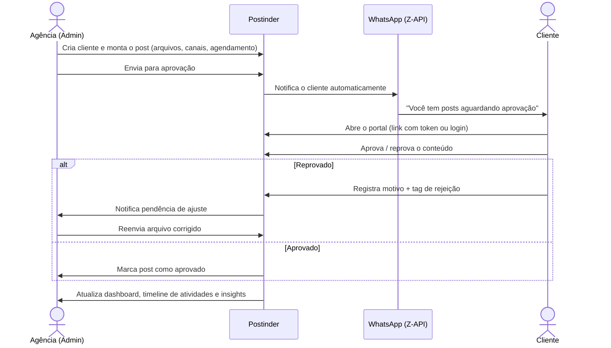

# Postinder

**A forma mais rápida de aprovar conteúdo entre agência e cliente.**

Postinder é uma plataforma de aprovação de conteúdo para agências de marketing e social media. A agência monta postagens com múltiplos arquivos — imagens, vídeos, áudios, PDFs, planilhas, apresentações — e envia para o cliente aprovar. O cliente recebe um aviso no WhatsApp, abre o portal, e aprova ou reprova o conteúdo com navegação livre entre as mídias. Tudo fica registrado: quem aprovou, quando, por quê, e com que taxa de retrabalho.
link para a documentação do projeto no google drive: https://drive.google.com/drive/folders/1ghJMYBAHZU-S7oBk4vqhSNVMymca9MCM?usp=drive_link

---

## O problema que resolve

Aprovação de conteúdo entre agência e cliente hoje normalmente acontece em canais que não foram feitos pra isso: grupo de WhatsApp com trinta imagens soltas, planilha de status desatualizada, e-mails perdidos em thread. O resultado é sempre o mesmo:

- Ninguém sabe ao certo o que já foi aprovado e o que ainda está pendente.
- Feedback de reprovação se perde ("não gostei", sem dizer o quê).
- A agência não tem dado nenhum sobre taxa de aprovação, tempo de resposta do cliente ou motivos recorrentes de retrabalho.
- O cliente precisa de login/senha só pra bater o olho em três imagens.

Postinder resolve isso com um fluxo dedicado: a agência centraliza a criação e o envio, o cliente aprova pelo celular sem fricção, e todo o histórico vira dado — dashboard, atividades e métricas de aprovação prontos pra qualquer reunião de resultado.

---

## Como funciona



**Dois jeitos de o cliente acessar**, conforme o nível de fricção desejado:
- **Link mágico com token** — sem senha, expira automaticamente, ideal para aprovação rápida pelo celular.
- **Login autenticado** — para clientes que acessam o painel com frequência e querem histórico completo.

A forma de aprovação é configurável pela agência: `content` consolida uma decisão para a postagem inteira, ou `item` permite escolhas provisórias por mídia, oficializadas quando o cliente conclui a análise (**Concluir análise**). Em qualquer modo, o cliente tem três reações possíveis: **Adorei**, **Aprovar** e **Solicitar ajuste** — as duas primeiras produzem a mesma aprovação operacional, e **Adorei** fica registrada como reação positiva no histórico oficial do post.

Cada submissão possui uma `content_revision`. A aprovação sela essa revisão em `approved_revision`, e a execução só é aceita enquanto o selo continuar corrente (registrada em `executed_revision`); conteúdo já aprovado precisa ser reaberto antes de qualquer alteração material, o que evita executar algo diferente do que o cliente viu.

---

## Funcionalidades

### Para a agência (admin)
- **Gestão de clientes** — cadastro com cor de marca, segmento, prazo de aprovação (SLA) configurável e número de WhatsApp; ativação/desativação sem perder histórico.
- **Criação de postagens** — múltiplos canais e formatos por post, upload de vários arquivos (imagem, vídeo, áudio, PDF, doc, planilha, apresentação, link de e-mail), trilha sonora opcional, reordenação, substituição e remoção de arquivos, agendamento e tags de funil.
- **Envio em lote** — manda vários posts para aprovação de uma vez em vez de um por um.
- **Fila de aprovações** — visão consolidada de tudo que está pendente entre todos os clientes.
- **Dashboard e timeline de atividades** — auditoria de eventos (quem criou, aprovou, reprovou, reenviou) por cliente e por post.
- **Insights & Feedbacks** — taxa de aprovação, taxa de rejeição, aprovação por arquivo, tempo médio de decisão do cliente, ranking dos motivos de rejeição mais comuns, feedback mensal por cliente (nota + comentário), com apoio de IA para leitura dos dados.
- **Identidade visual configurável** — logo institucional próprio exibido dinamicamente na área interna e no portal do cliente, sem rebuild.
- **Configurações da plataforma** — retenção de arquivos após execução, forma de aprovação do cliente (`content`/`item`), políticas de campos obrigatórios/visíveis por postagem, feature flags (ex.: trilha sonora).
- **Controle de acesso por papel** — perfis `admin`, `manager`, `editor` e `viewer`, cada um com capacidades distintas; rotas administrativas exigem capacidade declarada e negam acesso por padrão sem política explícita.
- **Notificações internas** — central de notificações no painel, marcadas como lida/não lida por usuário.

### Para o cliente
- **Portal de aprovação dedicado**, com login ou link privado recuperável pelo admin (sem gerar novo token a cada acesso).
- **Fila guiada** ordenada pela data prevista, avançando automaticamente após cada decisão — ou visão detalhada completa, configurável por cliente.
- **Prévia nativa por tipo de arquivo** — imagem, vídeo, áudio, PDF, documento, planilha, apresentação e e-mail, sem precisar baixar nada.
- **Três reações à postagem** — **Adorei**, **Aprovar** e **Solicitar ajuste**; as duas primeiras aprovam operacionalmente, e **Adorei** fica marcada como reação positiva no histórico.
- **Feedback consolidado** — nota e comentário sobre o mês/entrega.
- **Aviso automático via WhatsApp** sempre que há algo novo para revisar.

---

## Arquitetura

Monorepo com backend e frontend desacoplados por uma API REST versionada.

```text
postinder/
├── apps/admin/          # Painel React (Vite) — admin e portal do cliente
├── backend/              # API REST em Express + TypeScript (Clean Architecture por módulo)
│   └── src/modules/      # auth, posts, clients, portal, branding, platformSettings, soundtracks, integrations...
├── database/
│   └── migrations/       # migrations versionadas — única fonte de verdade estrutural
├── docs/                 # guias de arquitetura, deploy e operação
└── docker-compose.yml    # PostgreSQL local
```

Em desenvolvimento, arquivos ficam em `uploads`; em produção o backend usa Supabase Storage. A topologia de referência é Vercel para o frontend, Render para a API e Supabase para banco e Storage.

### Stack

| Camada | Tecnologia |
|---|---|
| Frontend | React + Vite |
| Backend | Node.js + TypeScript + Express |
| Banco de dados | PostgreSQL (migrations versionadas) |
| Autenticação | JWT com contextos distintos para admin e cliente |
| Armazenamento de arquivos | Local em dev · Supabase Storage em produção |
| Notificação | WhatsApp via Z-API |
| IA | Insights agregados via Anthropic (dados pseudonimizados) |
| Deploy | Vercel (frontend) + Render (API) + Supabase (banco/storage) |

---

## Rodando localmente

### Requisitos
- Node.js 24.x (o `.node-version` fixa `24.16.0`)
- npm 11.13.0
- Docker Desktop, para o PostgreSQL local
- Git

### Setup rápido (Windows)

```powershell
.\docs\deploy\setup.ps1
npm run dev
```

### Setup manual (qualquer sistema)

```bash
npm ci
npm ci --prefix backend
npm ci --prefix apps/admin
docker compose up -d
cd backend
npm run db:migrate
cd ..
npm run dev
```

`npm ci` é o comando padrão em desenvolvimento, validação e deploy — `npm install` fica reservado a mudanças deliberadas de dependências.

Para incluir dados de demonstração depois das migrations:

```powershell
$env:APP_MODE = 'demo'
cd backend
npm run db:seed-demo
```

| Serviço | URL |
|---|---|
| Painel (frontend) | http://localhost:5173 |
| API (backend) | http://localhost:3001 |
| Health check | http://localhost:3001/health |
| PostgreSQL | `127.0.0.1:5433` |

### Contas de demonstração (após seed)

| Perfil | E-mail | Senha |
|---|---|---|
| Admin | `admin@postinder.local` | `Admin@123456` |
| Cliente | `cliente@example.com` | `Cliente@123456` |

Essas credenciais são exclusivas de demonstração e não devem ser usadas em produção. Para bootstrap sem seed, configure `INITIAL_ADMIN_NAME`, `INITIAL_ADMIN_EMAIL` e `INITIAL_ADMIN_PASSWORD` e rode `npm run db:bootstrap-admin` em `backend`.

### Variáveis de ambiente principais

| Variável | Descrição |
|---|---|
| `DATABASE_URL` | Conexão com o PostgreSQL |
| `JWT_SECRET` / `JWT_EXPIRY_MINUTES` / `JWT_REFRESH_EXPIRY_DAYS` | Configuração de autenticação |
| `APP_PUBLIC_URL` | URL usada para gerar os links do portal do cliente |
| `ZAPI_INSTANCE` / `ZAPI_TOKEN` / `ZAPI_CLIENT_TOKEN` | Credenciais da Z-API para envio automático de WhatsApp |
| `SUPABASE_URL` / `SUPABASE_SERVICE_ROLE_KEY` / `SUPABASE_STORAGE_BUCKET` | Armazenamento de arquivos em produção |
| `DEPLOYMENT_MODE` / `ENABLE_DEMO_RESET` | Controlam se o reset de dados de demonstração pode existir no ambiente |
| `VITE_API_URL` / `VITE_DEPLOYMENT_MODE` / `VITE_GA_MEASUREMENT_ID` | Únicas variáveis públicas consumidas pelo frontend |

Segredos (Anthropic, Z-API) nunca pertencem ao frontend — vivem só no backend.

---

## Banco de dados

As migrations em `database/migrations` são a única fonte de verdade estrutural:

```bash
cd backend
npm run db:migrate
```

O startup não cria nem corrige schema automaticamente. Em deploy, `npm run db:migrate` deve rodar como Pre-Deploy Command/release step bloqueante, antes do Start Command — com backup lógico e preflight do banco obrigatórios antes de migrations em produção. A migration `002_development_seed.sql` é histórica e não faz parte do migrador estrutural. Entre as mais recentes: a `018` adiciona a preferência de portal do cliente e a cópia cifrada recuperável do token; a `020` adiciona o modo de aprovação e drafts provisórios; a `021` introduz revisão/certificação de conteúdo e histórico oficial; a `022` adiciona visibilidade e snapshot do funil; a `023` torna versions/decisions de soundtrack append-only sem bloquear cascatas legítimas; e a `024` acrescenta a reação opcional **Adorei** e o `item_snapshot` oficial.

---

## Autenticação e autorização

- JWT administrativo e JWT de cliente são contextos distintos; refresh tokens também têm contexto explícito.
- Perfis: `admin` (todas as capacidades), `manager` (operações não destrutivas), `editor` (fluxo editorial), `viewer` (somente leitura).
- Toda rota administrativa exige autenticação, identidade administrativa e capacidade declarada — sem política explícita, o acesso é negado por padrão.
- Portal autenticado de cliente e portal por token privado são fluxos separados.

---

## Comandos úteis

```bash
npm run dev                          # backend + frontend juntos

npm run build --prefix backend
npm run build --prefix apps/admin

cd backend
npm run db:migrate
npm run db:seed-demo
npm run db:bootstrap-admin
npm run storage:cleanup-retention    # retenção manual (o scheduler interno também roda sozinho)
```

Para reiniciar só o banco local: `docker compose down -v`, depois `docker compose up -d` e `npm run db:migrate` em `backend`.

---

## Documentação

- [Deploy, banco e ambientes](docs/DEPLOYMENT.md)
- [Checklist de deploy](docs/deploy/CHECKLIST_DEPLOY_TESTE.md)
- [Storage e retenção](docs/STORAGE_ARCHITECTURE.md)

## Notas para o time

- Não versione o arquivo `.env`.
- O banco local roda via Docker — sem ele, a API não lê nem grava dados.
- Rotinas de manutenção (retenção de posts executados, limpeza de arquivos de clientes inativos, arquivamento por desativação) rodam via scheduler interno e migrations versionadas em `database/migrations/`.
